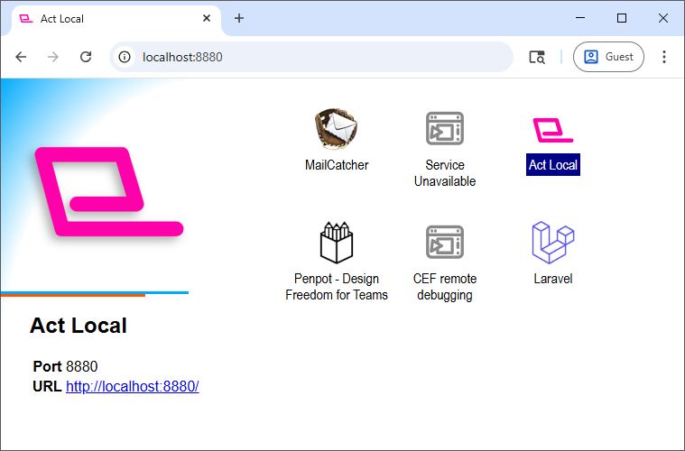

# Act Local

https://github.com/SuperFLEB/act-local



Act Local is a small browser-based application that lists open ports serving HTTP and HTTPS on
your local machine and presents them in a clickable list. This allows you to easily see
and access all the local development servers or local Web applications running on your machine.
Updates happen in real-time as services are added and removed, and titles and icon information
are automatically determined from the content being served.

## Status

This is currently in early development. (It's a scratch-an-itch project so I can access
all my open Docker development servers and my Penpot local instance without needing to remember
port numbers, and it does that well enough for me.) It does what it does, but matters such as
security review, tests, and advanced features still need to be done.

## To use

(This should get easier once I get it into an NPM package, but for now, you have to build it.)

Requirements: Node.js 16+, Yarn, and a POSIX shell for running scripts

```shell
# Clone this repository
yarn install

# Build the application (the first time you use it)
yarn build

# Run the server
node dist/server.js
```

If you want to use different ports, specify them as environment variables. At build time, they
will be used as default ports in the built application. At run time, they will override the defaults.

e.g.,

```shell
# To build with different default ports
HTTP_PORT=8800 WS_PORT=8801 yarn build
```
```shell
# To run with different ports
HTTP_PORT=8800 WS_PORT=8801 node dist/server.js
```

Note that Node.js dependencies are not bundled into the `dist/` output, so this must be run from
within the project directory.

Once you have the server running, browse to http://localhost:8880 or whatever port the HTTP server
is running on. You should see all ports that are currently serving HTTP or HTTPS pages, and can
double-click on them to open them in a new tab.

## Upcoming Features and Enhancements

This may or may not get significant future development, but if it does, here are my targets:

- Hide applications or change options like hostname or protocol, based on factors
  such as the port name, response headers, and page title.
- Persist applications with the ability to run a startup command if they are not active.
- Layout enhancements, sorting, grouping, etc.
- Tests, security review, etc.

